<a name="readme-top"></a>

<p align="center">
  
</p>
<p align="center">
  
 
 
 
 
</p>

# Matcha

This project is about creating an app allowing two potential lovers to meet, from the registration to the final encounter. A user will then be able to register, connect, fill his/her profile, search and look into the profile of other users, like them, chat with those that he matched with.

To meet all the required features, a **Full Stack Javascript**
 stack has been chosen: **[React](https://reactjs.org/)** **+ [Tailwind](https://tailwindcss.com/)** for the client, we used **[Node.js](https://nodejs.org/en/) + [Express](https://expressjs.com/)** for the back with the help of **[Socket.io](http://Socket.io)** to handle all the real-time events in the application and **[Postgres]()** for the database. We weren't allowed to use ORM for the database. All SQL queries are written manually. The application is fully dockerized.

Through this project, we learned about:

- Micro-frameworks
- Users account management
- Sockets
- GPS location
- Data validation and security
- Docker-compose

## Table of Contents

- [Installation](#installation)
- [Screenshots](#screenshots)
- [Features](#features)
- [To go further](#to-go-further)
- [Contact](#contact)

## Installation

```bash
git clone https://github.com/Korkrane/42MATCHA.git
cd 42MATCHA/server
touch .env
```

In the `.env` file add these fields:

```txt
ACCESS_TOKEN_SECRET=4242XX424208
REFRESH_TOKEN_SECRET=424200000X1

```

Finally, at the root of the project

```txt
./run.sh
```

When the images are built, you can access the site here:

```txt
https://localhost:3000/signin
```

### Nodemailer system setup with google

> ⚠️ If you do not follow the steps below, you won’t be able to access to a complete personalized user creation. However you can still access the app by creating a dummy user.

<details>
<summary>Steps to follow</summary>

1. Go to your google account settings

    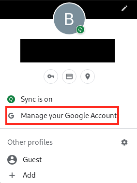

2. Go to the `Security` settings

    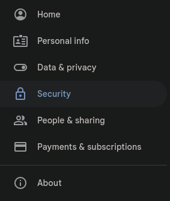

3. Click on `App passwords`

   

4. Click on Select app and then Other, you can call it matcha for example

    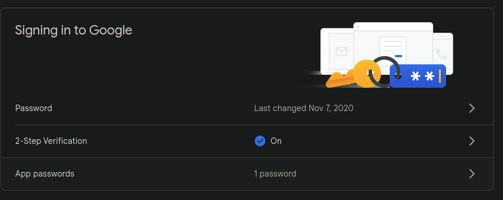

5. Save the generated password

    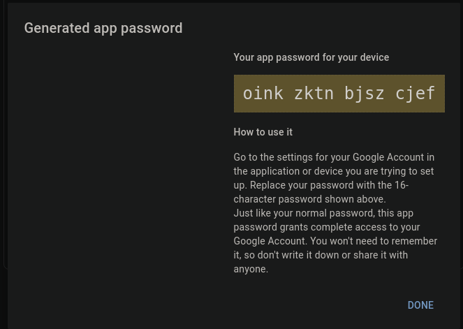

6. add these variables to your `/server/.env`

```bash
NODEMAILER_USER=google_email_address
NODEMAILER_PASS=google_app_password
```

<p align="right">(<a href="#readme-top">back to top</a>)</p>

</details>
<br>

## Screenshots

<details>
<summary>Signin page</summary>

 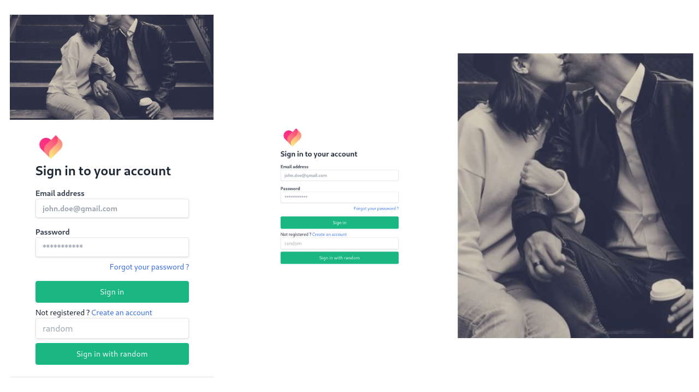
</details>

<details>
<summary>Signup page</summary>

 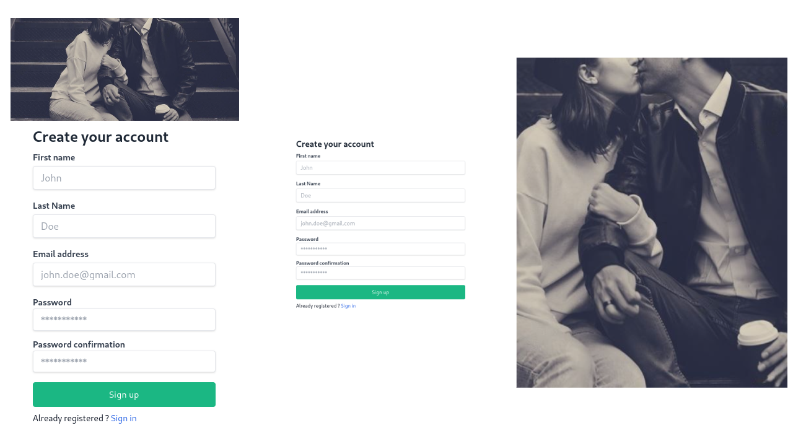
</details>

<details>
  <summary>Home page</summary>
  <details>
    <summary>mobile view</summary>
      <div align="center">
        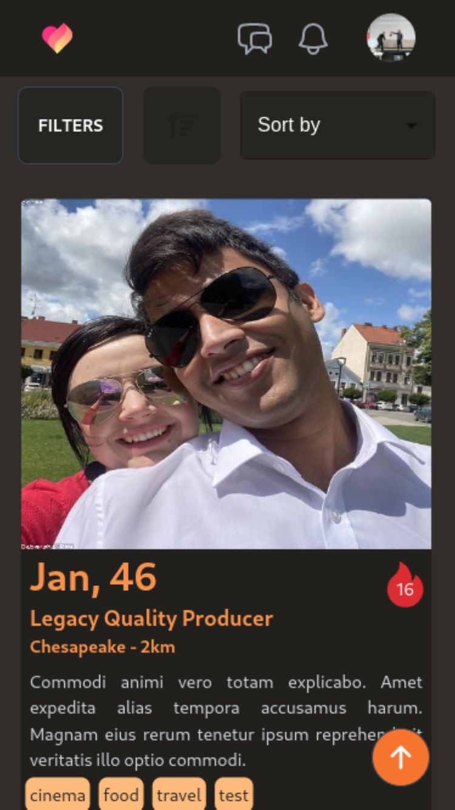
        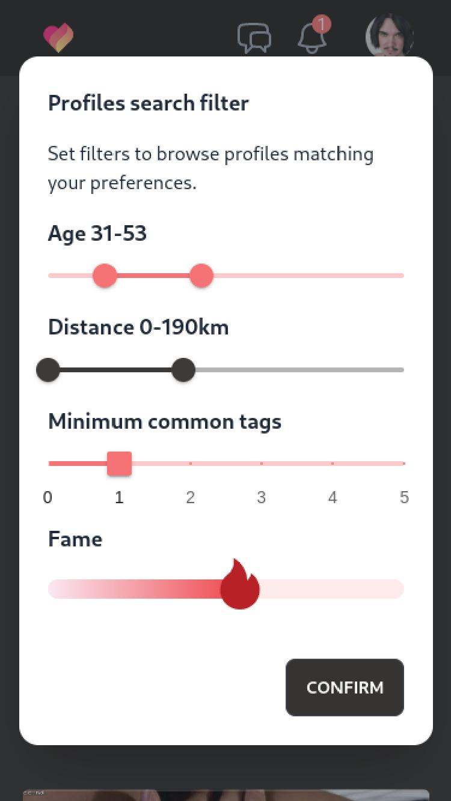
      </div>
  </details>
  <details>
    <summary>desktop view</summary>
    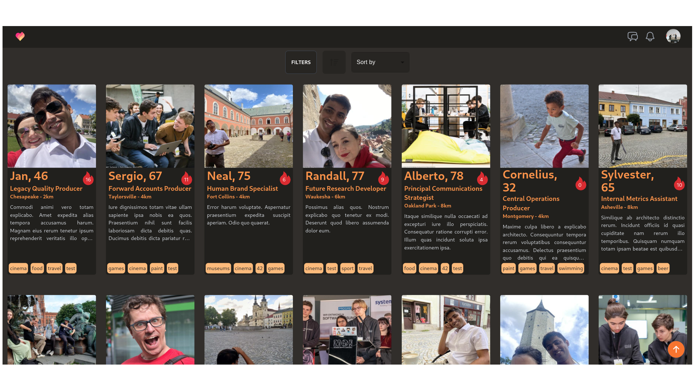
  </details>
</details>

<details>
  <summary>Settings page</summary>
  <details>
    <summary>mobile view</summary>
      <div align="center">
        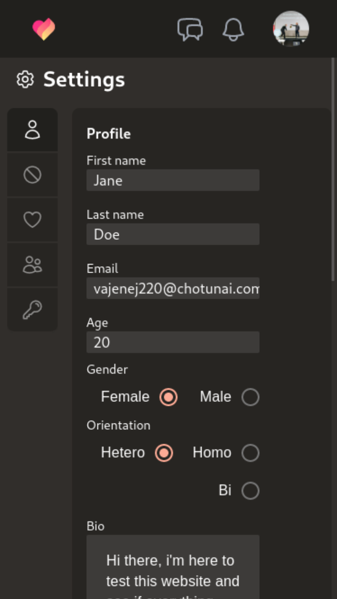
        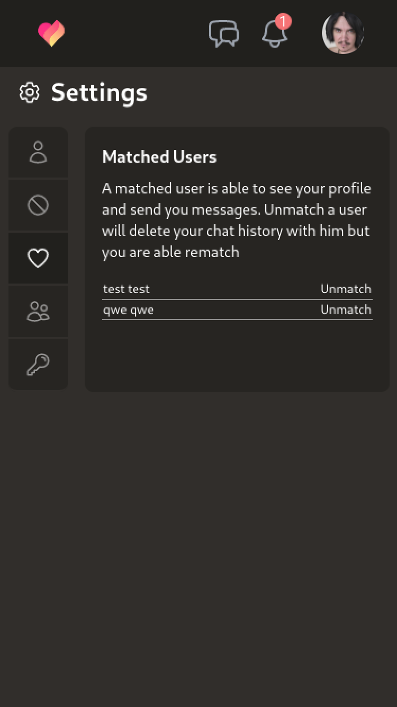
      </div>
  </details>
  <details>
    <summary>desktop view</summary>
     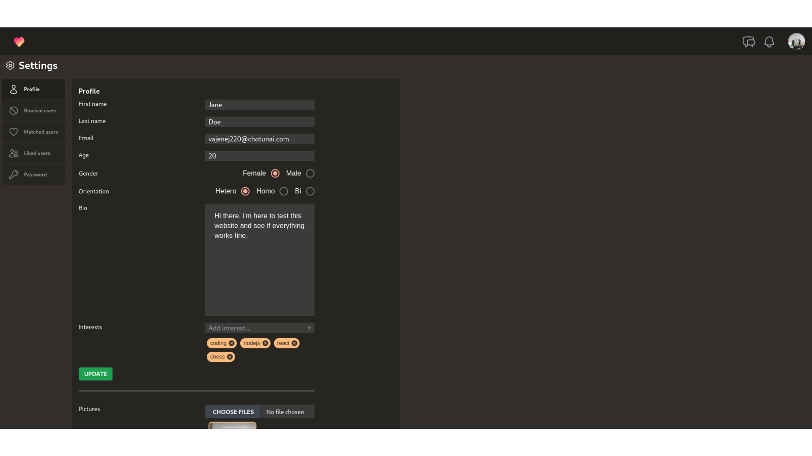
  </details>
</details>

<details>
  <summary>Chat page</summary>
  <div align="center">
    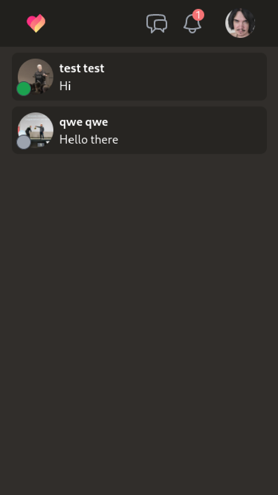
    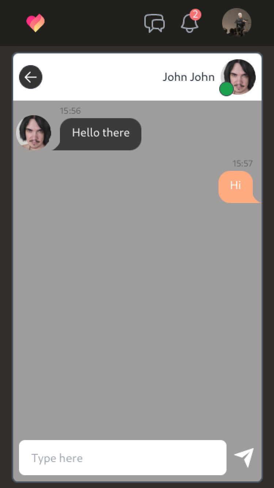
  </div>

</details>

<p align="right">(<a href="#readme-top">back to top</a>)</p>

## Features

- Database
    - users seeding
    - password hashing
- Users
    - user creation
    - get user GPS location
    - pictures upload
    - user details edition
    - user relation management (like/block/report)
    - user profiles browsing based on matching algorithm
    - user profiles browsing with custom filters (age/distance/fame)
- Chat & Notifications
    - real-time notifications for visits/likes/matches
    - real-time chat messages between matched users
- Authentication
    - jwt authentication & protected API routes
    - email confirmation on signup
    - email on reset/forgot password

<p align="right">(<a href="#readme-top">back to top</a>)</p>

## To go further

Through this project, we implemented a lot of features that was new to us and with libraries that we weren't always used to. Some parts could be clearly be coded in a simpler way or refactored to reduce the complexity.

Here is a list of what could be improved in general:

- group all the axios call in a single place in the client instead of storing them individually in component files
- make more reusable components to remove duplicates generic components in the client pages
- create a specific file for socket event handling in the back
- improve the chat UI globally
- display a visual notice on some user actions instead of only noticing errors (password reset, user details update, when 2 users match)
- add a caching system for the api calls when a user request to browse a lot of profiles with the same filters

## Contact

- [Thibaut Thervieu](https://github.com/thervieu)
- [Baudoin Haas](https://github.com/Korkrane)

<p align="right">(<a href="#readme-top">back to top</a>)</p>
